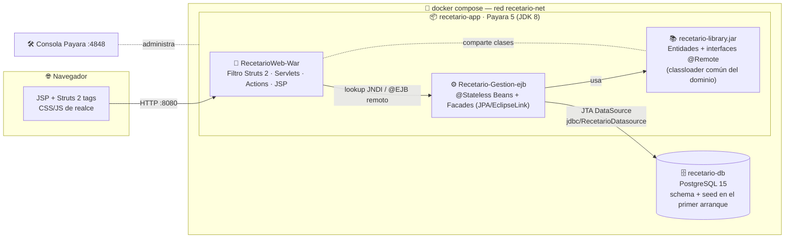
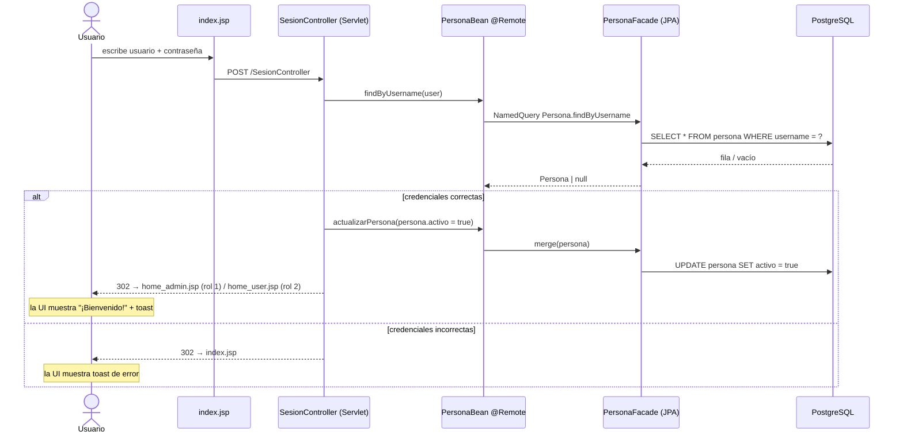
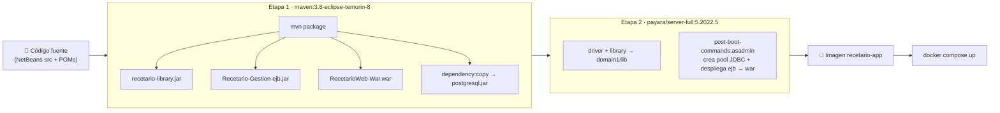
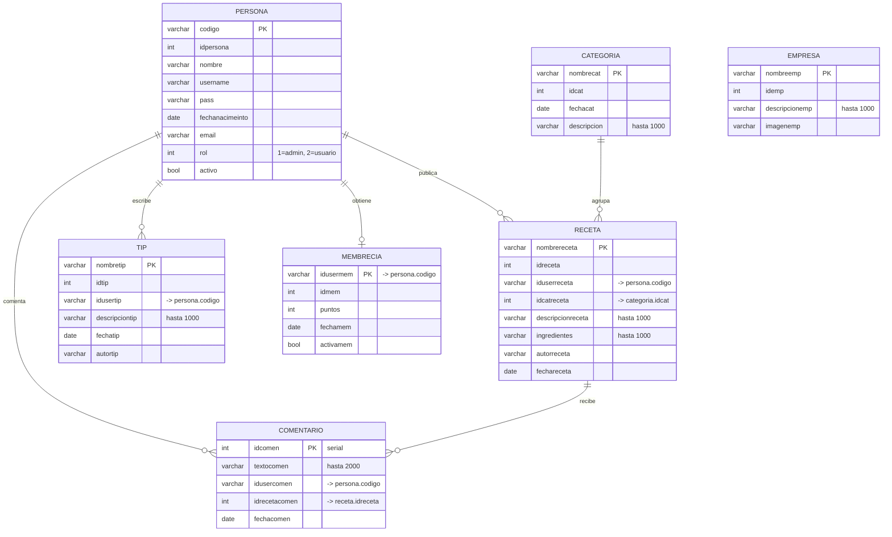

<div align="center">

# 🍳 RecetarioWeb

### *Amantes de la Buena Cocina*

**Recetario social** donde cada persona registra sus recetas, comparte tips de cocina,
comenta las creaciones de los demás y suma puntos de membresía.
Aplicación **Java EE** de tres módulos, empaquetada para levantarse **entera con un solo comando** gracias a Docker.


</div>

---

## 📖 Tabla de contenidos

| | Sección | | Sección |
|---|---|---|---|
| 🥘 | [El proyecto](#-el-proyecto) | 🧬 | [Modelo de datos](#-modelo-de-datos) |
| ✨ | [Funcionalidades](#-funcionalidades) | 🧰 | [Stack tecnológico](#-stack-tecnológico) |
| 🧱 | [Arquitectura](#-arquitectura) | 🚀 | [Despliegue local](#-despliegue-local-en-3-pasos) |
| 🔐 | [Flujo de autenticación](#-flujo-de-autenticación) | 🎨 | [Capa de interfaz](#-capa-de-interfaz) |
| ⚙️ | [Pipeline de build](#-pipeline-de-build) | 📁 | [Estructura del repositorio](#-estructura-del-repositorio) |
| | | ⚠️ | [Notas y deuda técnica](#-notas-y-deuda-técnica) |

---

## 🥘 El proyecto

RecetarioWeb es una plataforma web de recetas de cocina pensada como red social ligera:

- **Usuarios** que se registran, editan su perfil y cambian su contraseña.
- **Recetas** con foto, ingredientes, autor, categoría y descripción extensa.
- **Tips** de técnica de cocina redactados por la comunidad.
- **Categorías** para navegar el catálogo (Postres, Entradas, Platos fuertes, Bebidas, Vegano…).
- **Empresas** proveedoras destacadas (distribuidoras, lácteos, tostadores de café…).
- **Comentarios** sobre cada receta.
- **Membresía** por puntos: publicar recetas otorga puntos y desbloquea la membresía activa.
- **Roles**: `1` administrador (gestiona todo el catálogo) · `2` usuario estándar.

Nació como proyecto académico de *Ingeniería Web* (arquitectura NetBeans + Ant + GlassFish) y
en este repositorio se **moderniza el empaquetado** —sin reescribir la lógica— para poder
ejecutarlo hoy en cualquier máquina con Docker.

---

## ✨ Funcionalidades

<table>
<tr><th>Cualquier visitante</th><th>Usuario autenticado</th><th>Administrador</th></tr>
<tr valign="top"><td>

- Ver el catálogo de **recetas**
- Ver **tips**, **categorías** y **empresas**
- **Registrarse** en la plataforma
- Iniciar sesión

</td><td>

- Publicar **recetas** y **tips**
- **Comentar** recetas
- Sumar **puntos de membresía**
- Editar **datos personales**
- **Cambiar contraseña**
- Cerrar sesión

</td><td>

- Todo lo anterior +
- Crear **categorías**
- Crear **empresas**
- Alta de recetas/tips como oficiales
- Ver el **listado de usuarios** registrados

</td></tr>
</table>

> 💡 Al **iniciar** y **cerrar sesión** la interfaz muestra una animación de bienvenida/despedida
> y una notificación *toast*, resueltas 100 % en el front.

---

## 🧱 Arquitectura

Aplicación **Java EE 7** de 3 módulos desplegada en un servidor de aplicaciones **Payara 5**,
con la base de datos y el servidor orquestados por **Docker Compose**.



**Cómo encaja cada pieza**

| Módulo | Empaquetado | Contiene | Se resuelve en runtime desde |
|---|---|---|---|
| `RecetarioWeb-Library` | `jar` | Entidades JPA + interfaces `@Remote` + excepción de dominio | `domain1/lib` de Payara *(classloader común)* |
| `Recetario-Gestion-ejb` | `ejb` | `@Stateless` Beans + `*Facade` + `persistence.xml` | despliegue standalone en Payara |
| `RecetarioWeb-War` | `war` | Filtro Struts 2, Servlets, Actions, ~20 JSP, assets | despliegue standalone en Payara |

> La librería compartida se coloca en `domain1/lib` para que **WAR y EJB carguen exactamente
> la misma clase** `Persona` / `*Remote`; sin eso, el `@EJB` remoto entre despliegues rompería
> con `ClassCastException`.

---

## 🔐 Flujo de autenticación



Al cerrar sesión, `LogoutServlet` invalida la cookie `nickname`, marca `activo = false`
y redirige a `index.jsp`, donde la UI muestra la despedida.

---

## ⚙️ Pipeline de build

Un único `Dockerfile` multietapa: **no necesitas Java, Maven ni Payara instalados**.



---

## 🧬 Modelo de datos

PostgreSQL, **7 tablas sin claves foráneas** (las relaciones son por convención de columnas `id*`).
El esquema y una **semilla rica en contenido** se cargan en el primer arranque de la BD.



**Datos semilla incluidos** (`docker/db/init/`): 7 personas · 5 categorías · 10 recetas ·
7 tips · 6 empresas · 10 comentarios · 4 membresías, con descripciones largas y realistas.

| Usuario | Contraseña | Rol |
|---|---|---|
| `admin` | `admin123` | Administrador |
| `laura`, `carlos`, `marta`, `nico`, `valentina`, `andres` | `<usuario>123` | Usuario |

---

## 🧰 Stack tecnológico

### Lenguajes

| Lenguaje | Uso |
|---|---|
| **Java 8** | EJB, Facades, Servlets, Struts Actions |
| **JSP / JSTL / OGNL** | Vistas y plantillas |
| **SQL (PostgreSQL)** | Esquema y semilla |
| **HTML5 · CSS3 · JavaScript (vanilla)** | Capa de realce de interfaz |

### Frameworks y librerías

| Componente | Versión | Rol |
|---|---|---|
| Java EE / Jakarta EE | **7** (`javax.*`) | EJB 3.2 · JPA 2.1 · Servlet 3.1 · JTA · Bean Validation |
| EclipseLink | **2.7.11** (incluido en Payara) | Proveedor JPA |
| Apache Struts | **2.3.37** | Controlador web (filtro + Actions) |
| Apache Commons FileUpload | 1.4 | Subida de archivos |
| Bootstrap | 3 + tema *Leroy* | Base visual (conservada) |
| Font Awesome | 4.2.0 | Iconografía |
| **`recetario-ui`** | propio | Capa de animaciones, luces, toasts y responsive |

### Runtime, build e infraestructura

| Herramienta | Versión | Rol |
|---|---|---|
| **Payara Server Full** | `5.2022.5` (JDK 8) | Servidor de aplicaciones Java EE |
| **PostgreSQL** | `15-alpine` | Base de datos |
| Driver JDBC PostgreSQL | `42.5.6` | Conexión (pool `RecetarioconnectionPool`) |
| **Apache Maven** | `3.8` (imagen `eclipse-temurin-8`) | Build multimódulo |
| **Docker** + **Docker Compose v2** | — | Orquestación local |

> **Base de datos:** PostgreSQL 15. La unidad de persistencia `Recetario-Gestion-ejbPU`
> usa la fuente de datos JTA `jdbc/RecetarioDatasource`, creada al arrancar Payara mediante
> `docker/payara/post-boot-commands.asadmin`.

---

## 🚀 Despliegue local en 3 pasos

### Requisitos

Solo **Docker Engine** + **Docker Compose v2**. Nada más.

```bash
docker --version
docker compose version
```

### Pasos

```bash
# 1 · Clonar y entrar
git clone https://github.com/juansebasv/RecetarioWeb.git
cd RecetarioWeb

# 2 · Construir y levantar (BD + Payara + despliegue automático)
docker compose up -d --build

# 3 · Seguir el arranque hasta ver los despliegues OK
docker compose logs -f app
#   ... "Recetario-Gestion-ejb was successfully deployed"
#   ... "RecetarioWeb-War was successfully deployed"
```

### Accesos

| Recurso | URL |
|---|---|
| 🍽️ **Aplicación** | <http://localhost:8090/RecetarioWeb-War/> |
| 🛠️ Consola de administración Payara | <http://localhost:4849/> *(usuario `admin`, sin contraseña)* |
| 🗄️ PostgreSQL | `localhost:5433` · db `RecetarioWeb` · `postgres` / `sebastian94` |

> Los puertos del host se definen en **`.env`** (`APP_PORT=8090`, `ADMIN_PORT=4849`, `DB_PORT=5433`)
> para no chocar con otros proyectos. Cámbialos ahí si lo necesitas.

### Comandos útiles

```bash
docker compose ps                 # estado de los contenedores
docker compose logs -f app        # logs de Payara
docker compose down               # apagar (conserva la base de datos)
docker compose down -v            # apagar y BORRAR la BD -> re-siembra limpia al volver a levantar
docker compose up -d --build app  # reconstruir solo la app tras cambios
```

---

## 🎨 Capa de interfaz

El template original (*Leroy*, Bootstrap 3) se **conserva intacto**; encima se añade una capa
de realce sin tocar el marcado de negocio:

- **Barra de menú** tipo *glass* fija, con iconos por sección, estado activo con degradado,
  *hover glow*, subrayado animado y hamburguesa en móvil.
- **Hero** con degradado y orbes desenfocados en movimiento (reemplaza la imagen externa muerta).
- **Tarjetas** con inclinación 3D y foco de luz que sigue al cursor, destello diagonal al pasar.
- **Botones** con brillo bajo el cursor y onda (*ripple*) al hacer clic.
- **Títulos** con degradado animado, **barra de progreso** de lectura, *reveal* al hacer scroll.
- **Toasts** + **overlay de bienvenida / despedida** al iniciar y cerrar sesión.
- Respeta `prefers-reduced-motion` y es responsive.

Archivos: `RecetarioWeb-War/web/css/recetario-ui.css` y `RecetarioWeb-War/web/js/recetario-ui.js`,
enlazados desde cada JSP.

---

## 📁 Estructura del repositorio

```
RecetarioWeb/
├── pom.xml                         # POM padre (multimódulo Maven)
├── Dockerfile                      # build 2 etapas: Maven -> Payara
├── docker-compose.yml              # servicios db + app
├── .env                            # puertos del host
│
├── RecetarioWeb-Library/           # 📚 jar compartido
│   ├── pom.xml
│   └── src/com/RecetarioWeb/{Entitys, Beans/*Remote, Exception}
│
├── Recetario-Gestion-ejb/          # ⚙️ módulo EJB
│   ├── pom.xml
│   └── src/
│       ├── conf/persistence.xml    # unidad JPA + fuente de datos JTA
│       └── java/com/RecetarioWeb/{Beans/*Bean, Negocio/*Facade}
│
├── RecetarioWeb-War/               # 🧩 módulo web
│   ├── pom.xml
│   ├── src/java/{struts.xml, com/RecetarioWeb/Controller/*}
│   └── web/                        # ~20 JSP + css/ + js/ + img/
│       ├── css/recetario-ui.css    # <- capa de realce
│       └── js/recetario-ui.js      # <- animaciones + toasts
│
└── docker/
    ├── db/init/
    │   ├── 01-schema.sql           # 7 tablas
    │   └── 02-seed.sql             # semilla rica en contenido
    └── payara/
        └── post-boot-commands.asadmin  # pool JDBC + orden de despliegue
```

---

## ⚠️ Notas y deuda técnica

Este repo **moderniza el empaquetado** pero conserva la lógica original tal cual. Puntos conocidos:

| Tema | Detalle |
|---|---|
| Contraseñas | Se guardan y comparan en **texto plano** (`persona.pass`). |
| Claves primarias | La PK de casi todas las tablas es el `nombre` (varchar); el campo `id*` se rellena con `COUNT(*)` al insertar → colisiona tras borrados. |
| Estado global | Los singletons `Client` y `Usuario` guardan estado por usuario en campos `static` (no *thread-safe*). |
| Subida de imágenes | `ServletEmpresa` escribe en una ruta Windows fija (`C:/Users/Personal/...`). |
| `PersonaBean.findByActivo` | Llama por error a `findByCodigo` (copy-paste). |
| `page_view_receta.jsp` | Da 500 si se abre **directo** (NPE en `ControllerReceta.cargarComent` cuando no hay receta seleccionada); funciona por el flujo normal (*"Leer más"*). |
| Tests | No hay pruebas automatizadas. |
| Credenciales de BD | `sebastian94` figura en `docker-compose.yml` (entorno local, coincide con el `sun-resources.xml` histórico). |

---

<div align="center">

Proyecto académico · Ingeniería Web · Universidad Central
🍴 *Cocina, comparte, repite.*

</div>
